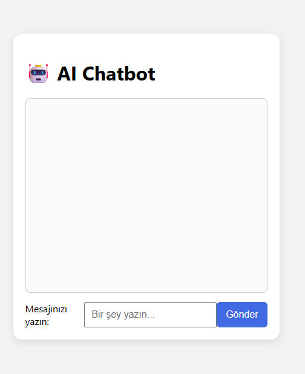

# 🤖 Yapay Zekalı Chatbot (Frontend Only)

Bu proje, yalnızca HTML, CSS ve JavaScript kullanarak basit bir yapay zeka chatbot arayüzü oluşturur. Kullanıcının yazdığı mesajlara anahtar kelimelerle yanıt verir.

## 🚀 Özellikler

- Basit komut tanıma (Merhaba, Saat kaç, Nasılsın, Tarih vb.)
- Mesajlaşma arayüzü
- Dinamik DOM güncellemeleri
- Tamamen frontend’de çalışır

## 🧠 Öğrenilen Konular

- Form olayları
- DOM oluşturma ve güncelleme
- Basit string eşleşme ile yanıt üretimi
- scrollTop kullanımı ile kutuyu aşağı kaydırma

## 👥 Ekip/Kaynaklar

- [MDN Web Docs - DOM](https://developer.mozilla.org/en-US/docs/Web/API/Document_Object_Model)
- [W3Schools - JavaScript](https://www.w3schools.com/js/)

🖼️ Arayüz Görünümü,

|  |