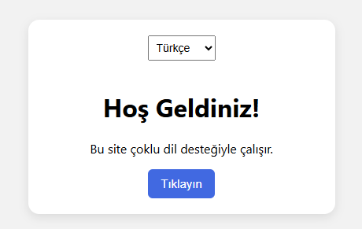
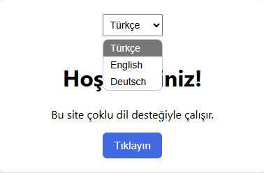

# 🌐 Çoklu Dil Desteği Olan Site

Bu proje, HTML, CSS ve JavaScript kullanılarak oluşturulmuş basit bir çok dilli web sitesidir. Kullanıcı, üstteki açılır menüden dil seçerek anında içerik çevirisini görebilir.

## 🚀 Özellikler

- Dinamik dil değiştirme
- JSON dosyalarıyla çoklu dil yönetimi
- Erişilebilir ve kullanıcı dostu arayüz

## 🧠 Öğrenilen Konular

- i18n kavramı (uluslararasılaştırma)
- JSON veri ile içerik eşleme
- JavaScript DOM manipülasyonu
- Olay dinleyiciler (event listeners)

## 👥 Ekip/Kaynaklar

- [MDN Web Docs - JSON](https://developer.mozilla.org/en-US/docs/Learn/JavaScript/Objects/JSON)
- [W3C Accessibility Practices](https://www.w3.org/WAI/)

🖼️ Arayüz Görünümü

|----------|----------------|
|  |  | 