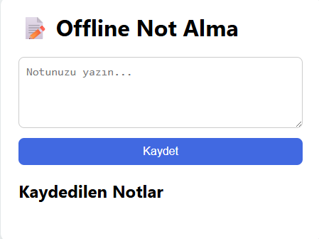

# 📝 Offline Not Alma Uygulaması (PWA)

Bu proje, kullanıcıların internet bağlantısı olmasa bile not almasını sağlayan bir PWA (Progressive Web App) uygulamasıdır. Notlar localStorage’da saklanır ve service worker sayesinde offline çalışabilir.

## 🚀 Özellikler

- Offline çalışma (service worker ile)
- Not alma ve listeleme
- PWA manifest ile mobil uyumluluk
- Basit ve kullanıcı dostu arayüz

## 🧠 Öğrenilen Konular

- Progressive Web App (PWA) kavramları
- Service Worker kurulumu ve önbellekleme
- localStorage kullanımı
- Manifest dosyası ile uygulama yapılandırması

## 👥 Ekip/Kaynaklar

- [Google Developers - PWA](https://developers.google.com/web/progressive-web-apps)
- [MDN Web Docs - Service Workers](https://developer.mozilla.org/en-US/docs/Web/API/Service_Worker_API)

🖼️ Arayüz Görünümü

|----------|----------------|
|  | 