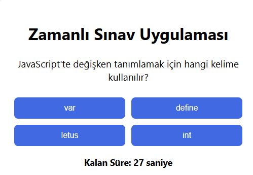

# Etkileşimli Zamanlı Sınav Uygulaması

Bu proje, kullanıcıların belirlenen süre içinde soruları cevaplayabildiği dinamik ve interaktif bir sınav uygulamasıdır.

## Özellikler

- Zamanlayıcı ile sınav süresi kontrolü
- Doğru/yanlış cevap geri bildirimi
- Sonuçların gösterilmesi
- Kolay kullanılabilir arayüz

## Öğrenilenler

- DOM manipülasyonu
- Event handling (olay yönetimi)
- Zamanlayıcı kullanımı (setInterval, clearInterval)
- Dinamik içerik oluşturma

## Kaynaklar

- [MDN JavaScript Timers](https://developer.mozilla.org/en-US/docs/Web/API/WindowOrWorkerGlobalScope/setInterval)
- [MDN EventTarget.addEventListener](https://developer.mozilla.org/en-US/docs/Web/API/EventTarget/addEventListener)

🖼️ Arayüz Görünümü

|----------|----------------|
|  | 