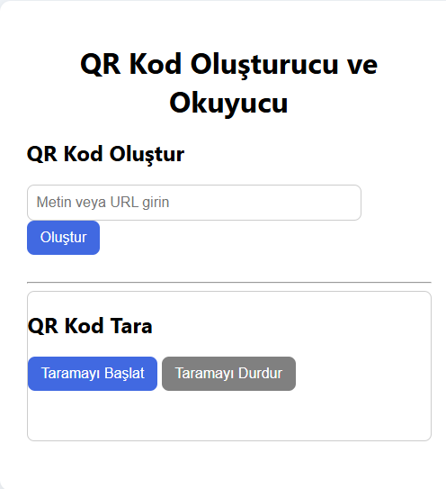

# QR Kod Oluşturucu ve Okuyucu

Bu proje, kullanıcıların kolayca QR kod oluşturmasını ve kamera kullanarak QR kod taraması yapmasını sağlar.

## Özellikler

- Metin veya URL’den QR kod oluşturma
- Kamera ile QR kod tarama ve sonucu anında gösterme
- Kullanıcı dostu arayüz

## Öğrenilenler

- Üçüncü parti kütüphanelerle çalışma (QRCode.js, Html5Qrcode)
- Kamera erişimi ve medya işlemleri
- DOM ve event yönetimi

## Kaynaklar

- [QRCode.js GitHub](https://github.com/davidshimjs/qrcodejs)
- [Html5Qrcode GitHub](https://github.com/mebjas/html5-qrcode)

🖼️ Arayüz Görünümü

|----------|----------------|
|  | 