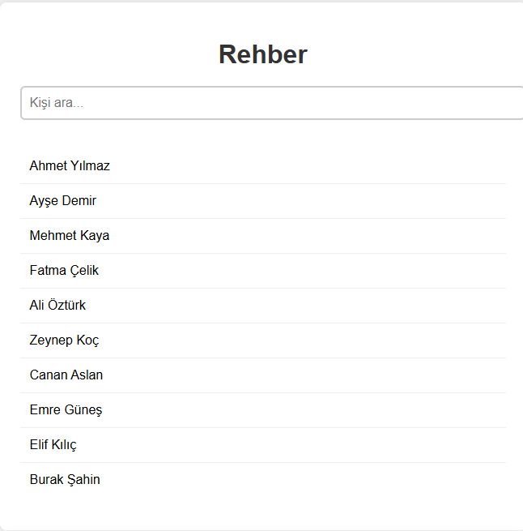

# Rehber Uygulaması

Bu basit uygulama, kullanıcıların kişi listesini arayıp filtreleyerek görüntüleyebileceği bir rehber sunar.

## 🚀 Özellikler

- Gerçek zamanlı arama filtresi
- Temiz ve sade kullanıcı arayüzü
- Listelemesi kolaylaştırılmış örnek veri

## 🛠️ Kullanılan Teknolojiler

- HTML
- CSS
- JavaScript (Vanilla)

## 📂 Klasör Yapısı

- `index.html`: Ana sayfa
- `style.css`: Tasarım
- `script.js`: Dinamik filtreleme işlevi

## 👥 Ekip / Kaynaklar

- Geliştirici: [ Quenn Exe ]
- Örnek veri ve ilham: openai, mdn

## 🔍 Nasıl Kullanılır?

1. Tarayıcınızda `index.html` dosyasını açın.
2. Arama çubuğuna kişi adını yazmaya başlayın.
3. Liste anında filtrelenerek eşleşen kişileri gösterir.
🖼️ Arayüz Görünümü

|----------|----------------|
|  | 