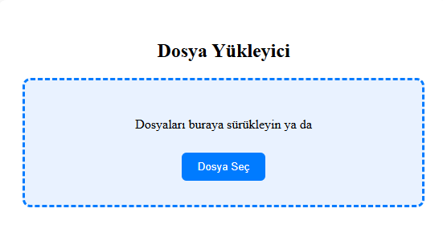

# Drag & Drop Dosya Yükleme

Bu proje, kullanıcıların dosyaları sayfaya sürükleyerek veya manuel olarak seçerek yükleyebileceği modern bir kullanıcı arayüzü sunar.

## 🚀 Özellikler

- Drag & drop desteği
- Dosya bilgilerini listeleme
- Gelişmiş stil ve kullanıcı deneyimi

## 🛠️ Kullanılan Teknolojiler

- HTML5
- CSS3
- Vanilla JavaScript

## 📂 Klasör Yapısı

- `index.html`: Ana sayfa
- `style.css`: Tasarım dosyası
- `script.js`: Drag & drop mantığı

## 👥 Ekip / Kaynaklar

- Geliştirici: [Senin Adın]
- İlham: [HTML5 Rocks], MDN Docs

## 🔍 Nasıl Kullanılır?

1. `index.html` dosyasını tarayıcıda aç.
2. Dosyaları sürükleyip bırak veya "Dosya Seç" butonunu kullan.
3. Seçilen dosyalar listelenir.

🖼️ Arayüz Görünümü

|----------|----------------|
|  | 