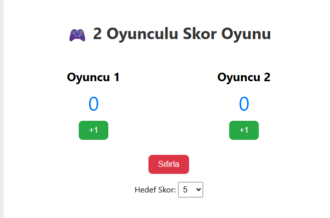

# 2 Oyunculu Gerçek Zamanlı Skor Oyunu

Bu projede, iki oyuncunun skorlarını gerçek zamanlı olarak takip edebileceğiniz basit ama etkileşimli bir oyun geliştirilmiştir.

## 🚀 Özellikler

- Skor takibi
- Hedef skor seçimi
- Oyun bitiş durumu ve renkli geri bildirim
- Sıfırlama işlevi

## 🛠️ Kullanılan Teknolojiler

- HTML
- CSS
- JavaScript

## 📂 Klasör Yapısı

- `index.html`: Ana sayfa
- `style.css`: Tasarım dosyası
- `script.js`: Oyun mantığı

## 👥 Ekip / Kaynaklar

- Geliştirici: [ Quenn Exe ]
- Kaynak ilhamı: Web Dev Simplified, MDN

## 🔍 Nasıl Kullanılır?

1. `index.html` dosyasını aç.
2. Oyuncular sırayla kendi butonlarına tıklasın.
3. Belirlenen skora ilk ulaşan kazanır.
4. "Sıfırla" ile yeniden başlat.

🖼️ Arayüz Görünümü

|----------|----------------|
|  | 