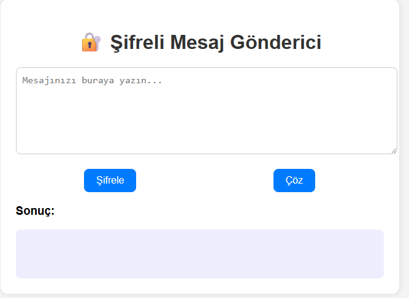
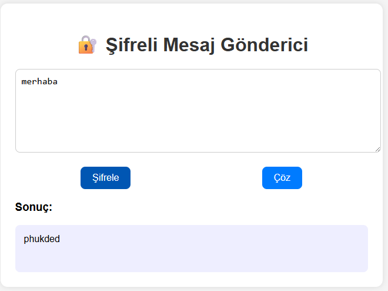

# 🔐 Şifreli Mesaj Gönderici (Kriptografi Projesi)

Bu proje, kullanıcıların bir metni şifreleyip çözmesini sağlayan basit bir frontend uygulamasıdır. Kullanılan algoritma, klasik Sezar şifrelemesidir.

## 🚀 Özellikler

- Şifreleme (Caesar Cipher ile)
- Çözme
- Temiz kullanıcı arayüzü

## 📂 Dosya Yapısı

- `index.html` – Ana sayfa
- `style.css` – Stil dosyası
- `script.js` – Şifreleme mantığı

## 🛠️ Kullanılan Teknolojiler

- HTML
- CSS
- JavaScript

## 👥 Ekip / Kaynaklar

- Geliştirici: [ Quenn Exe ]
- Algoritma: Caesar Cipher (M.Ö. 100’lerden ilham!)

## 🎯 Kullanım

1. Metni gir.
2. "Şifrele" tuşuna bas.
3. Şifrelenmiş mesajı kopyala veya çözmek için "Çöz" tuşunu kullan.
 
 🖼️ Arayüz Görünümü

|  |  | 