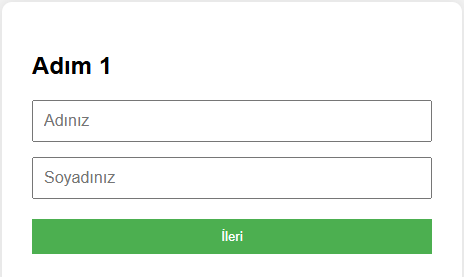
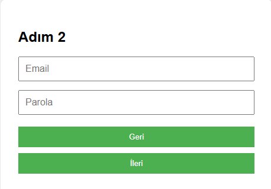
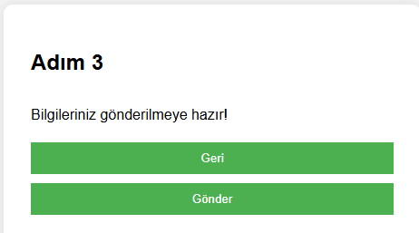

# Çok Adımlı Kayıt Formu (Multi-Step Registration Form)

## Açıklama
Bu proje, kullanıcıdan bilgileri adım adım toplamak için geliştirilmiş basit ve kullanıcı dostu bir çok adımlı formdur. Her adımda formun bir parçası gösterilir, kullanıcı ileri ve geri gidebilir.

## Özellikler
- Adım adım bilgi toplama
- Form kontrolü
- Kullanıcı dostu arayüz
- JavaScript ile dinamik geçişler

## Kullanılan Teknolojiler
- HTML, CSS, JavaScript

## Öğrenilecek Beceriler
- DOM manipülasyonu
- Form adımlarının yönetimi
- Event handling
- Kullanıcı deneyimi geliştirme

## Ekip / Kaynaklar
- Geliştirici: [Quenn Exe]
- Kaynak: MDN, CSS Tricks

# 🖼️ Arayüz Görünümü,

|  |  |  |