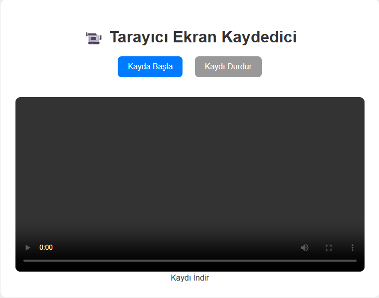

# 📹 Browser Tabanlı Ekran Kaydedici

Bu proje, tarayıcı üzerinden ekran kaydı almayı sağlar. Web API olan `MediaRecorder` ve `getDisplayMedia` kullanılmıştır.

## 🚀 Özellikler

- Tarayıcı ekranından kayıt alır
- Kayıt ön izlemesi yapılabilir
- WebM formatında kayıt indirme

## 📂 Dosya Yapısı

- `index.html`: Arayüz
- `style.css`: Stil dosyası
- `script.js`: Kayıt işlemleri

## 🔒 Notlar

- Kayıt başlatıldığında kullanıcıdan izin istenir
- Yalnızca modern tarayıcılar destekler (Chrome, Edge, Brave vb.)

## 👨‍💻 Geliştirici

- [ Quenn Exe ]

## 🔗 Kaynaklar

- [MDN Web Docs – MediaRecorder](https://developer.mozilla.org/en-US/docs/Web/API/MediaRecorder)
- [MDN – getDisplayMedia](https://developer.mozilla.org/en-US/docs/Web/API/MediaDevices/getDisplayMedia)
🖼️ Arayüz Görünümü

|----------|----------------|
|  | 