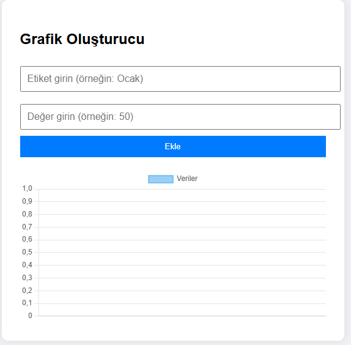

# Etkileşimli Grafik Çizici (Interactive Chart Drawer - Chart.js)

## Açıklama
Bu proje, kullanıcıların dinamik olarak veri girip anında grafik oluşturabildiği etkileşimli bir web uygulamasıdır. Chart.js kütüphanesi kullanılarak veriler çubuk grafikler olarak görselleştirilir.

## Özellikler
- Kullanıcıdan alınan etiket ve veri ile grafik oluşturma
- Dinamik güncellenebilir grafik
- Responsive yapı

## Kullanılan Teknolojiler
- HTML, CSS, JavaScript
- Chart.js (grafik çizimi için)

## Öğrenilecek Beceriler
- Chart.js ile grafik oluşturma
- Kullanıcıdan alınan verileri işleme
- DOM manipülasyonu ve canvas kullanımı
- Veri görselleştirme teknikleri

## Ekip / Kaynaklar
- Geliştirici: [Quenn Exe ]
- Kaynaklar: [Chart.js Docs](https://www.chartjs.org/docs/latest/), MDN

# 🖼️ Arayüz Görünümü,

|  |
