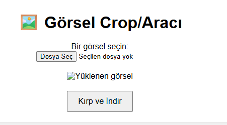

# ✂️ Görsel Crop/Aracı (Image Crop Tool)

Bu proje, kullanıcıların yüklediği bir görseli kırpmasına ve kırpılan kısmı indirmesine olanak tanır.

## 🚀 Özellikler

- Görsel yükleme
- Kırpma alanını fare ile seçme
- Kırpılan görseli PNG olarak indirme

## 🧠 Öğrenilen Konular

- FileReader API kullanımı
- Canvas'tan resim üretimi
- CropperJS entegrasyonu
- DOM manipülasyonu ve olay dinleme

## 🧰 Kullanılan Kütüphaneler

- [CropperJS](https://github.com/fengyuanchen/cropperjs)

## 👥 Ekip/Kaynaklar

- [MDN Web Docs - FileReader](https://developer.mozilla.org/en-US/docs/Web/API/FileReader)
- [CropperJS](https://fengyuanchen.github.io/cropperjs/)

🖼️ Arayüz Görünümü,

|  |